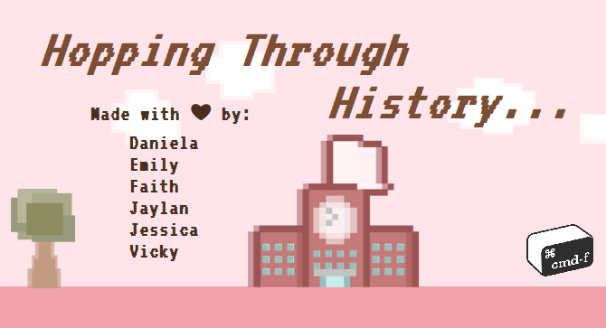
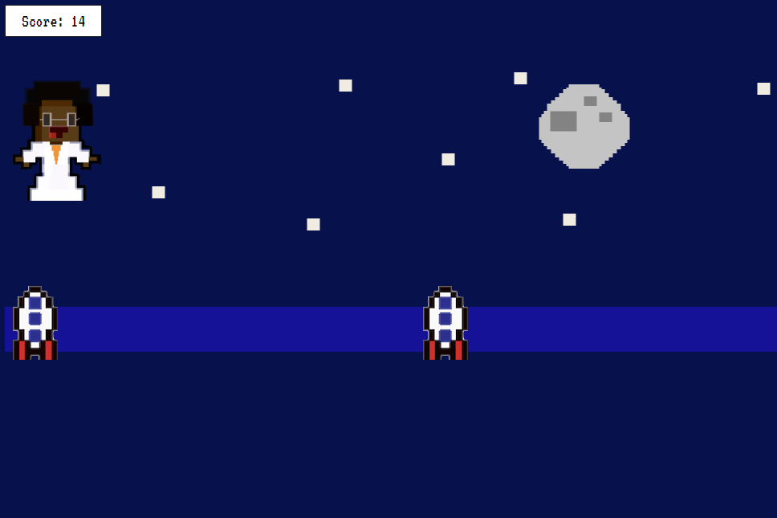

# Hopp-ing Through History

### cmd-f 2021 submission

***A short and charming journey seeking to educate about female representation in tech throughout history.***

**By: Daniela, Emily, Faith, Jaylan, Jessica, and Vicky**

Hopp-ing Through History is a web browser game that raises awareness about women in technology and the struggles they have faced throughout history. We wanted to create an easy yet aesthetically pleasing game that would educate players about the impact of women in technology to reduce gender bias.

### Try it out [**here**](https://faitht1023.github.io/)!
### Checkout our [**Devpost submission**](https://devpost.com/software/hopping-through-history)!
### A demo and introduction video:

*Grace HOPPer says...*

  

## Inspiration
Initially inspired by a team member Emily on her daily run, we transformed the simple [**Chrome T-Rex Game**](http://www.trex-game.skipser.com/) into a fun and cute adventure seeking into women’s irreplaceable impact in tech throughout history.

**The Problem:** Gender biases are oftentimes implicit:
- Did you know who was the first computer scientist that envisioned what computers are capable of?!
- Did you know who achieved the senior-most title at the engineering department at NASA in 1979?
- Did you know who founded and is serving as the CEO of the Afghan Citadel Software Company?

How can we educate others and try to combat implicit gender norms and biases with our beginner skill set yet ambitious spirits?

  

## What it does
**The Solution:** “Hopp-ing Through History” is a web browser game that raises awareness about women in technology and the struggles they have faced throughout history. We wanted to create an easy yet aesthetically pleasing game that would educate players about the impact of women in technology to reduce gender bias.

## How we built it
Since “Hopp-ing Through History” was inspired by the T-Rex Game, we watched [**tutorials**](https://www.youtube.com/watch?v=dQ6lYd6dyTI&ab_channel=CodewithAniaKub%C3%B3w) to learn the JavaScript, HTML and CSS syntax and better understand the T-Rex Game code implementation. Since we were all beginners, the public [**T-Rex Game code**](https://github.com/kubowania/chrome-trex-game) formed the skeleton of our implementation and we have modified it to better match our vision. We also used Figma to design the different iconic women and their obstacles and make our vision come to life. 

